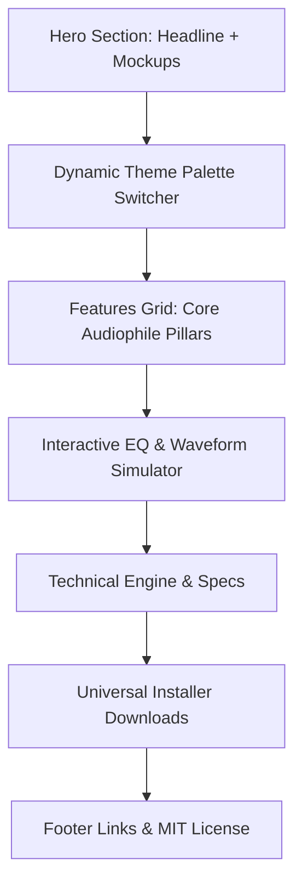

# ⚡🎵 SonicSnap - Your Music. Uncompromised & Instant.

SonicSnap is a gorgeous, high-fidelity offline-first music player tailored for absolute control, dynamic audio enhancement, and seamless multi-device flow.

This repository contains the source code for the official **SonicSnap Landing Page**, featuring a high-fidelity interactive audio sandbox, real-time dynamic color extraction simulator, responsive layout, and hardware-accelerated playback previews.

---

## 🎨 Interactive Live Demo Features

- **Real-Time Dynamic Theme Engine**: Simulates the mobile app's real-time color extraction. Select different albums in the carousel, and see the entire site dynamically adjust its color palette to match the album art.
- **Dynamic Acoustics Sandbox**: An interactive 5-band Graphic Equalizer matching our application specifications. Adjust sliders manually or click preset buttons (Bass Boost, Vocal Clear, Flat) to watch bands smoothly adapt.
- **Audio Waveform Spectrum Simulator**: Responsive visual canvas drawing multiple overlapping sine/cosine waves. Waves scale dynamically in amplitude and speed based on the interactive Equalizer slider positions.
- **Micro-Animations & Smooth Scrolling**: Highly optimized scrolling experience utilizing intersection observers for scroll-trigger animations.

---

## 📐 Site Layout & Architecture



---

## 🎧 The Pillars of SonicSnap

### 1. Pure Engineering, Immersive Audio
Powered by the high-performance `media_kit` hardware-accelerated playback pipeline. Enjoy low-latency playback of FLAC, MP3, WAV, M4A, and AAC files offline.

### 2. Dynamically Personal UI
No more boring static layouts. SonicSnap analyzes current track album art to generate custom HSL color accents, updating themes in real-time.

### 3. Dynamic Acoustics Control
Fine-tune your output signature with a customizable multi-band equalizer. Save, restore, and automatically pair custom presets with specific output devices.

### 4. TWS Smart Connection
Optimized for Bluetooth TWS buds. Connect and resume music instantly. Recovers playback state seamlessly even from cold starts.

---

## 🛠️ Technical Specifications

- **Database**: Local Hive DB (loads tracks and playlists instantly, offline-first)
- **Desktop Controls**: Full integration with Windows SMTC (System Media Transport Controls)
- **System Integrations**: Home Screen Widgets (Android) and "Open With" file associations.

---

## 🚀 Getting Started with the Site

### Prerequisites
To run the landing page locally, you only need a modern web browser. 

### Local Running Instructions
1. Clone this repository:
   ```bash
   git clone https://github.com/your-username/sonicsnap-music.git
   cd sonicsnap-music
   ```
2. Launch a local HTTP server to prevent CORS issues (highly recommended for canvas & assets loaded locally):
   ```bash
   # Using Python
   python -m http.server 8000
   
   # Or using Node.js
   npx serve .
   ```
3. Open `http://localhost:8000` (or `http://localhost:3000`) in your web browser.

---

## 📁 Repository Structure

- `index.html` - Core HTML layout and semantic content structure.
- `index.css` - Custom styling rules, variables, layout systems, and responsive selectors.
- `app.js` - Dynamic page logic, interactive EQ simulation, and audio visualizer canvas logic.
- `assets/landing/` - Image mockups and assets for visual previews:
  - `hero_mockup.png` - App showing smartphone & desktop UI.
  - `equalizer_screen.png` - Close-up equalizer screen settings.
  - `visualizer_demo.png` - Abstract visualizer layout preview.

---

## 📄 License
This project is open-source and licensed under the MIT License.
